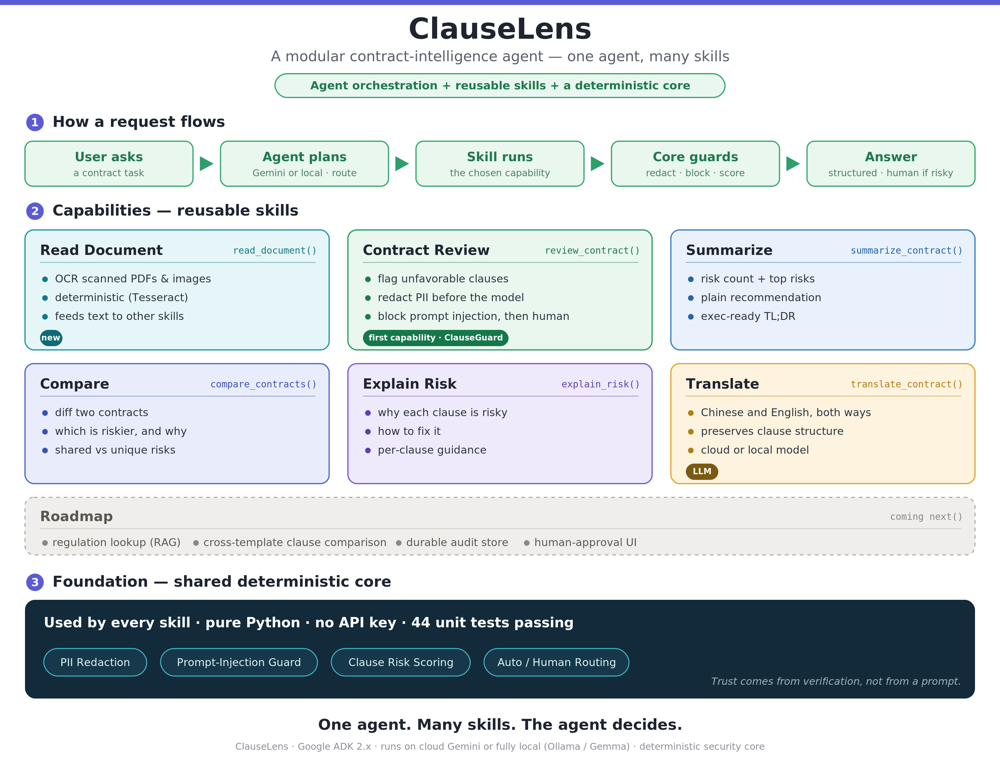

# 🔎 ClauseLens

> 🧠 **A modular contract-intelligence agent — one agent, many skills.**
> Built on **Google ADK 2.x**, it runs on **cloud Gemini *or* a fully local
> model** (Ollama / Gemma) — so it can run **100% on-device, no data leaving the
> machine**. The agent owns reasoning and orchestration; every domain capability
> is a reusable, framework-agnostic **skill**. New capabilities (regulation
> lookup, RAG, …) plug in without touching the agent.

🧬 ClauseLens is the platform evolution of **ClauseGuard** (the Kaggle × Google
capstone, [repo](https://github.com/WayneChou-bot/contract-risk-agent)).
ClauseGuard was one focused contract-review agent — here it becomes the **first
skill** of a platform, and a single agent decides which skill to call.



## 🧩 Architecture — three layers

- 🟣 **Agent layer** (`app/agent.py`) — a Gemini *or* local (Ollama/Gemma) `Agent`
  that understands intent, plans, and routes to the right skill. It can chain
  skills (e.g. OCR a scan, then review it) and never follows instructions hidden
  inside contract text.
- 🟦 **Skill layer** (`skills/`) — plain Python packages with **no dependency on
  the agent runtime**, so the same skills work under ADK today or any framework
  tomorrow.
- 🟡 **Foundation** — deterministic, unit-tested business logic (the security
  screen + risk engine from ClauseGuard) that gives hard guarantees the model
  can't bypass.

## 🛠️ Skills

| Skill | Tool | What it does | LLM? |
|---|---|---|---|
| 📄 Read document *(OCR)* | `read_document` | turn a PDF / scan / image into text with **deterministic on-device OCR** (Tesseract); feeds the text to other skills | ❌ |
| 🛡️ Contract review *(ClauseGuard)* | `review_contract` | flag unfavorable clauses, redact PII, block prompt injection, route auto/human | ❌ deterministic |
| 📝 Summarize | `summarize_contract` | executive summary: risk count, top risks, recommendation | ❌ |
| ⚖️ Compare | `compare_contracts` | compare two contracts, say which is riskier and why | ❌ |
| 💡 Explain risk | `explain_risk` | plain-language "why it's risky + how to fix" per clause | ❌ |
| 🌐 Translate | `translate_contract` | translate a contract (cloud Gemini or local model) | ✅ |
| 🧭 **Roadmap** | — | regulation lookup (RAG) · cross-template clause comparison · durable audit store · human-approval UI | — |

The agent **chains** skills, and the pipeline keeps the model out of the safety
path: **deterministic OCR → deterministic security screen → model only for the
judgment**. Give it a file path and it runs `read_document` (Tesseract) first,
then `review_contract` on the extracted text — so PII redaction and injection
defense see *text*, before any model is involved.

## 🚀 Setup & run

```bash
# 1) configure
cp .env.example .env        # Windows: copy .env.example .env  → set GOOGLE_API_KEY

# 2) deterministic tests — no API key needed
uv run --with pytest pytest -q          # ✅ 44 passed

# 3) the agent in the ADK dev-ui (cloud mode needs the Gemini key)
#    Windows: set GOOGLE_API_KEY=...   macOS/Linux: export GOOGLE_API_KEY=...
uv run adk web app --port 8080          # http://127.0.0.1:8080/dev-ui/?app=app
```

For OCR (the `read_document` skill), install the Tesseract binary plus the
`ocr` extra: `pip install '.[ocr]'` (Traditional-Chinese contracts also need the
`chi_tra` Tesseract language pack).

💬 In the dev-ui chat, just talk to it — the agent routes to the right skill:

```text
Read and review the contract in samples/contract_scan.pdf

Review this contract: This agreement renews automatically for one-year terms. The provider may terminate this agreement at any time at its sole discretion. Governed by the laws of Singapore.

Summarize it.

Explain the risks and how I should fix them.

Translate this contract to English: 本服務合約自動續約一年，乙方提前終止應付三倍違約金。

Compare these two contracts: A) <contract A text>  B) <contract B text>
```

📁 Sample contracts are in `samples/` — including `contract_scan.pdf`, a
**scanned-look PDF** for demoing the OCR → review chain.

> 🖥️ **Note on the UI.** The chat panel, the agent graph (root agent → tools), and
> the Events / Traces inspector are **Google ADK's built-in developer UI**
> (`adk web`) — not a custom frontend. ClauseLens provides the agent, the skills,
> and the deterministic business logic; ADK provides the runtime and the UI.

## 🔐 Run fully local (data never leaves your machine)

The reasoning model is pluggable. The default cloud path is convenient for demos,
but **OCR and the whole security/risk engine are deterministic Python that always
run on-device**, so only the agent's reasoning and `translate` ever touch a model.
Point those at a local model and nothing leaves the box:

```bash
pip install '.[local]'          # ADK LiteLLM bridge
ollama pull gemma4 && ollama serve
# Windows: set MODEL_BACKEND=local   macOS/Linux: export MODEL_BACKEND=local
uv run adk web app --port 8080
```

> ⚠️ **Privacy honesty.** In **cloud** mode the contract text is sent to Google's
> API. The **free** AI Studio tier may use your prompts to improve Google products
> and may be human-reviewed — use a **paid/Vertex** key or **`MODEL_BACKEND=local`**
> for anything sensitive. ClauseLens's distinctive guarantee is **deterministic
> safety control** (below), which holds in either mode; true **data localization**
> requires local mode.

## 💡 Why this design

- ♻️ **Reusability** — a skill is decoupled from the agent and the framework. The
  same `contract_review` skill could be called from ADK, another agent SDK, or a
  plain FastAPI endpoint.
- 🧱 **Extensibility** — add a capability by adding a skill; the agent's reasoning
  doesn't change. Swap the domain (HR, finance, insurance) by swapping skills.
- ✅ **Trust by verification** — the security guarantees live in deterministic,
  unit-tested Python, not in a prompt. Trust comes from verification, not from
  hoping the model behaves.

## 🔒 Security — deterministic safety control

The differentiator isn't a clever prompt; it's that **the model is kept out of the
safety control path**. OCR, PII redaction (TW national ID, US SSN, cards, phones,
emails — ZH & EN), prompt-injection detection, clause scoring, and auto/human
routing are all deterministic, unit-tested Python. A scanned document is turned
into text, screened, and routed **before** the reasoning model is asked for a
judgment; an injected document is escalated to a human with the model bypassed. A
clever prompt inside a contract cannot talk the system into auto-approving or into
leaking PII — that guarantee comes from verification (44 tests), not from trust.
See `skills/contract_review/`.

## 📄 License

Apache 2.0 — see [LICENSE](LICENSE).
